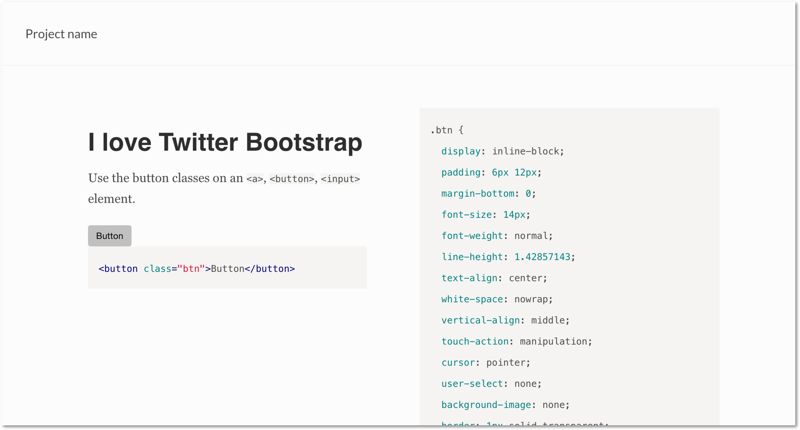

# psg-theme-sassline

[](http://badge.fury.io/js/psg-theme-sassline) [](https://gemnasium.com/sotayamashita/psg-theme-sassline)

Sassline theme for [postcss-style-guide](https://github.com/morishitter/postcss-style-guide)

## Installation

```bash
$ npm install psg-theme-sassline
```

## Theme

<p align="center">
  
</p>

## License

MIT © Sota Yamashita
